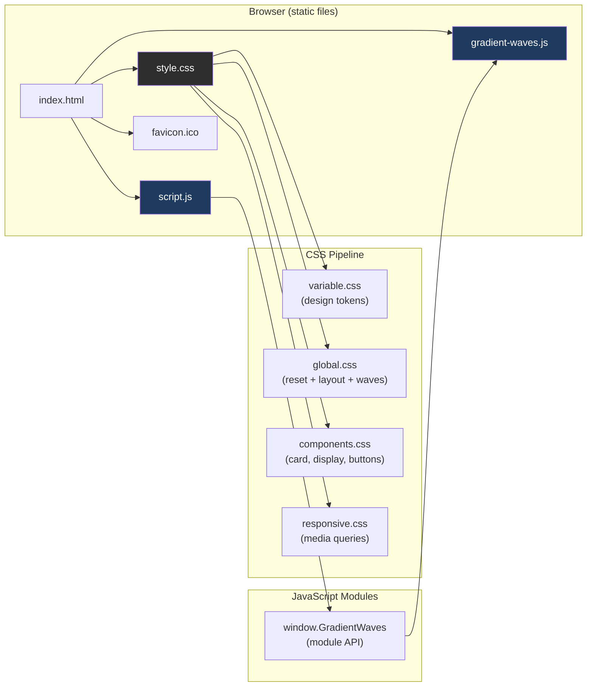
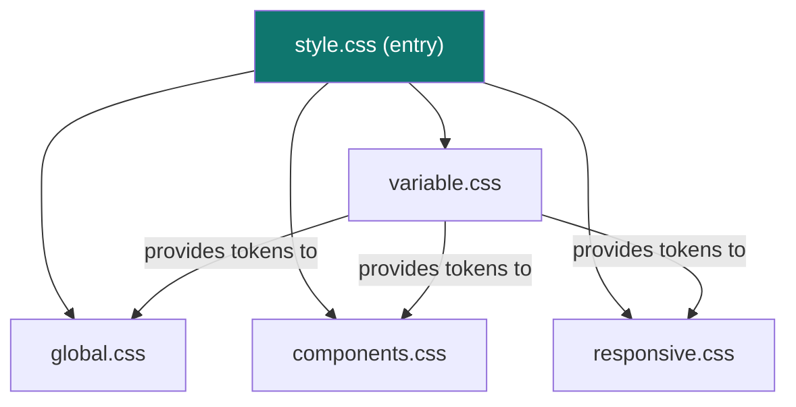
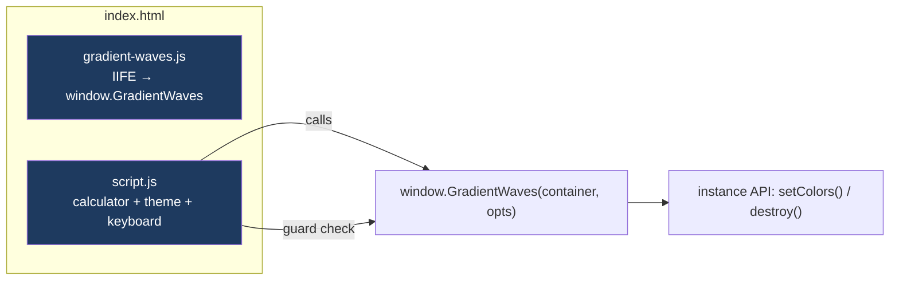
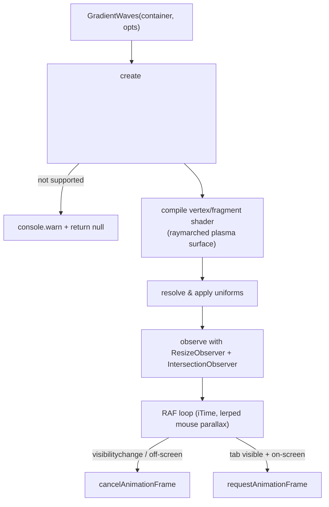
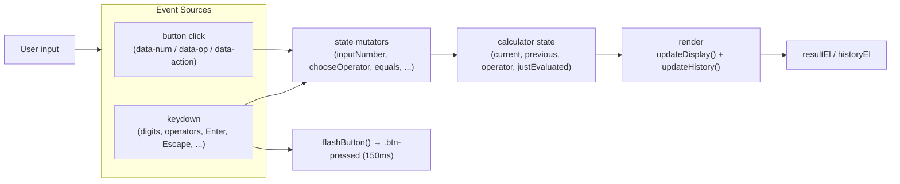
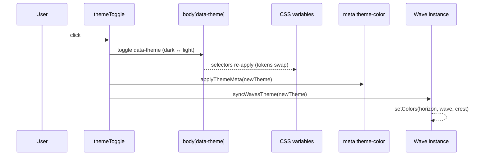
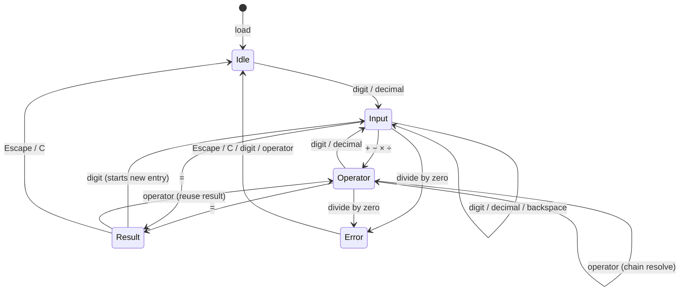

# ARCHITECTURE.md — Technical Architecture

Architecture documentation for the AICalculator — a vanilla HTML/CSS/JS calculator with no framework, no build tool, and no runtime dependencies. It runs entirely as a static web page.

---

## 1. Architecture Overview

The application is a **single static page** composed of three cooperating layers:

1. **HTML** (`index.html`) — declarative structure and metadata, including the sidebar.
2. **CSS** — a modular pipeline of design tokens → base → components → responsive rules.
3. **JavaScript** — two independent modules: the calculator logic + theme controller + sidebar (`script.js`) and the self-contained WebGL2 background (`gradient-waves.js`).

There is no server, no bundler, and no external CDN. The page loads assets via relative paths and works by simply opening `index.html`.



---

## 2. Directory Structure

```
AICalculator/
├── index.html                    # Single page: structure, meta, script/style tags
├── assets/
│   ├── css/
│   │   ├── variable.css          # Design tokens (CSS custom properties)
│   │   ├── global.css            # Reset, base layout, waves container
│   │   ├── components.css        # Card, display, theme button, button grid
│   │   ├── responsive.css        # Breakpoint media queries
│   │   └── style.css             # Entry point (@import order: tokens → base → components → responsive)
│   ├── js/
│   │   ├── gradient-waves.js     # Standalone IIFE → window.GradientWaves
│   │   └── script.js             # Calculator state, theme control, keyboard handler
│   └── favicon/                  # favicon.ico
├── docs/
│   ├── ARCHITECTURE.md           # This document
│   ├── CHANGELOG.md              # Release history
│   ├── CONTEXT.md                # Project context & decisions
│   ├── DESIGN.md                 # Visual/UX design documentation
│   └── SPEC.md                   # Functional & non-functional specification
└── README.md                     # Project overview
```

---

## 3. CSS Architecture

`style.css` is the single stylesheet referenced by `index.html`. It uses `@import` to assemble four modules in a strict order so that tokens exist before they are consumed:



**Module responsibilities:**

| Module           | Responsibility                                                                                  |
| ---------------- | ----------------------------------------------------------------------------------------------- |
| `variable.css`   | All design tokens as CSS custom properties scoped under `body[data-theme="dark"]` / `body[data-theme="light"]`, including sidebar tokens. |
| `global.css`     | Universal reset, base `body` layout (centered flex, `overflow: hidden`), and the `.waves-bg` fixed full-screen layer. |
| `components.css` | Glass card (`.calculator`), display (`.result`/`.history`), theme button (`.theme-btn`), fixed top-left viewport sidebar toggle (`.sidebar-toggle`), sidebar (`.sidebar`), button grid (`.btn*`), focus-visible styles, and keyboard-sync `.btn-pressed` state. |
| `responsive.css` | Mobile-first breakpoints (`≤360px` shrink, `≥480px` widen), sidebar drawer behavior (`≤768px` mobile overlay, `≥769px` desktop side panel). |

**Theming contract:** the `data-theme` attribute on `<body>` is the single source of truth for the theme. Every color token is defined once per theme in `variable.css`; components consume them via `var(--token)`.

---

## 4. JavaScript Architecture

Two independent modules. `gradient-waves.js` loads first (order in `index.html`), exposing a factory on `window`; `script.js` consumes it defensively.



### 4.1 `script.js` — Calculator & Theme Controller

**DOM references:** `resultEl`, `historyEl`, `buttons`, `themeToggle`, `wavesBg`, `themeColorMeta`.

**State variables:**

| Variable         | Purpose                                                             |
| ---------------- | ------------------------------------------------------------------- |
| `current`        | The operand currently being typed / displayed (string).             |
| `previous`       | The stored left-hand operand when an operator is pending.            |
| `operator`       | The pending operator (`+`, `−`, `×`, `÷`).                          |
| `justEvaluated`  | Flag set after `=` so the next digit/operator starts a fresh entry.  |
| `wavesInstance`  | Reference to the WebGL module instance (null if unsupported).       |

**Core functions:**

| Function            | Responsibility                                                            |
| ------------------- | ------------------------------------------------------------------------- |
| `formatNumber`      | Adds thousands separators, preserves sign and decimals.                   |
| `updateDisplay`     | Renders `current` into `resultEl`.                                        |
| `updateHistory`     | Renders the expression into `historyEl` (keeps a non-breaking space when empty). |
| `inputNumber`       | Appends a digit (caps input at 12 digits), handles entry after evaluation.|
| `inputDecimal`      | Appends `.` once per number.                                              |
| `clearAll`          | Resets all state to the initial "0".                                      |
| `negate`            | Toggles the sign; ignored in the `Error` state.                           |
| `percent`           | Divides the current value by 100; ignored in the `Error` state.           |
| `clearEntry`        | Resets the current entry to `0` without touching the pending operator/history. |
| `deleteLast`        | Removes the last digit (falls back to `0`); clears everything after an evaluation. |
| `square`            | Squares the current value; ignored in the `Error` state.                  |
| `sqrt`              | Square root of the current value; negative input yields `Error`.          |
| `compute`           | Pure arithmetic over two operands; returns `NaN` on division by zero.     |
| `chooseOperator`    | Resolves a pending operation (chaining), stores the new operator.         |
| `equals`            | Evaluates, formats the result (or `Error`), clears the pending operator.  |
| `trimResult`        | Caps precision (`toFixed(8)` + trim; falls back to `toPrecision(10)` for large values). |
| `applyThemeMeta`    | Syncs `<meta name="theme-color">` with the active theme.                  |
| `syncWavesTheme`    | Pushes the theme's wave colors into the WebGL instance via `setColors`.   |
| `flashButton`       | Adds a transient `.btn-pressed` highlight to the button matching a key.   |
| `fitResultFont`     | Progressively scales the result font (via `--result-font-size`) so long numbers are always fully visible. |
| `openSidebar`       | Opens the sidebar (adds `.open` class, shows overlay, updates aria attributes, and moves focus to the sidebar). |
| `closeSidebar`      | Closes the sidebar and profile menu, then returns focus to the toggle.                                   |
| `toggleSidebar`     | Toggles sidebar open/closed.                                                                              |
| `toggleProfileMenu` | Toggles the profile dropdown menu.                                                                        |
| `closeProfileMenu`  | Closes the profile dropdown menu.                                                                         |

### 4.2 `gradient-waves.js` — Self-contained WebGL2 Background

A single IIFE that exposes `window.GradientWaves(container, opts)` and returns an instance object `{ setColors(horizon, wave, crest), destroy() }`.

**Internal flow:**



**Lifecycle & performance controls:**

- **`ResizeObserver`** — resizes the canvas backing store to the container size (DPR capped at 2).
- **`IntersectionObserver`** — pauses rendering when the canvas scrolls out of view.
- **`visibilitychange`** — pauses rendering when the tab is hidden.
- **`pointermove`/`pointerleave`** — drives the parallax target; motion is lerped for smoothness.
- **`prefers-reduced-motion`** — disables the animation loop entirely.
- **`destroy()`** — cancels the loop and removes listeners and the canvas (used for teardown).

---

## 5. Data Flow — User Interaction

The same input pathways (click and keyboard) converge on the same state mutators, and every mutation ends in a render pass. This guarantees the display and the internal state never drift apart.



**Keyboard → button mapping (sync):** every mapped key also flashes its corresponding button so the UI visibly echoes the keystroke. Arrow, paging, and Home/End navigation keys are intercepted (`preventDefault`) so a hardware keyboard cannot scroll or jump the page; Space remains available for native button activation. Calculator shortcuts are ignored while typing in the sidebar Search field.

---

## 6. Theme System

Theming is a three-way sync driven by the toggle button. All three sinks derive from one source of truth: `body.dataset.theme`.



- **CSS sink** — `body[data-theme="..."]` swaps every token; components update automatically via `var(...)`.
- **Browser UI sink** — `<meta name="theme-color">` is rewritten by `applyThemeMeta()`.
- **WebGL sink** — the shader's three color uniforms are rewritten by `syncWavesTheme()` → `setColors()`; no canvas re-initialization required.

---

## 7. Calculator State Machine

The calculator behaves as a small state machine. The guard on the `Error` state prevents any subsequent operation from corrupting the display (`negate`/`percent` are no-ops while in `Error`; `chooseOperator` resets the state cleanly).



---

## 8. Related Documents

| Document              | Purpose                                             |
| --------------------- | --------------------------------------------------- |
| `README.md`           | Project overview, features, quick start.            |
| `docs/DESIGN.md`      | Visual/UX design, tokens, shader details.           |
| `docs/SPEC.md`        | Functional & non-functional specification + test matrix. |
| `docs/CONTEXT.md`     | Project context, decisions (ADRs), conventions.     |
| `docs/CHANGELOG.md`   | Release history.                                    |
