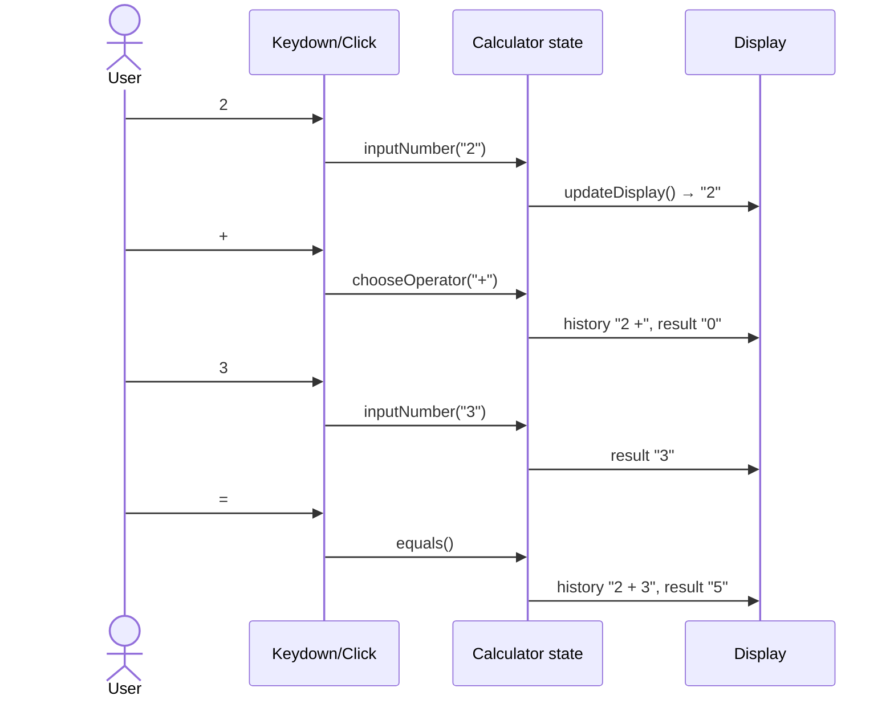
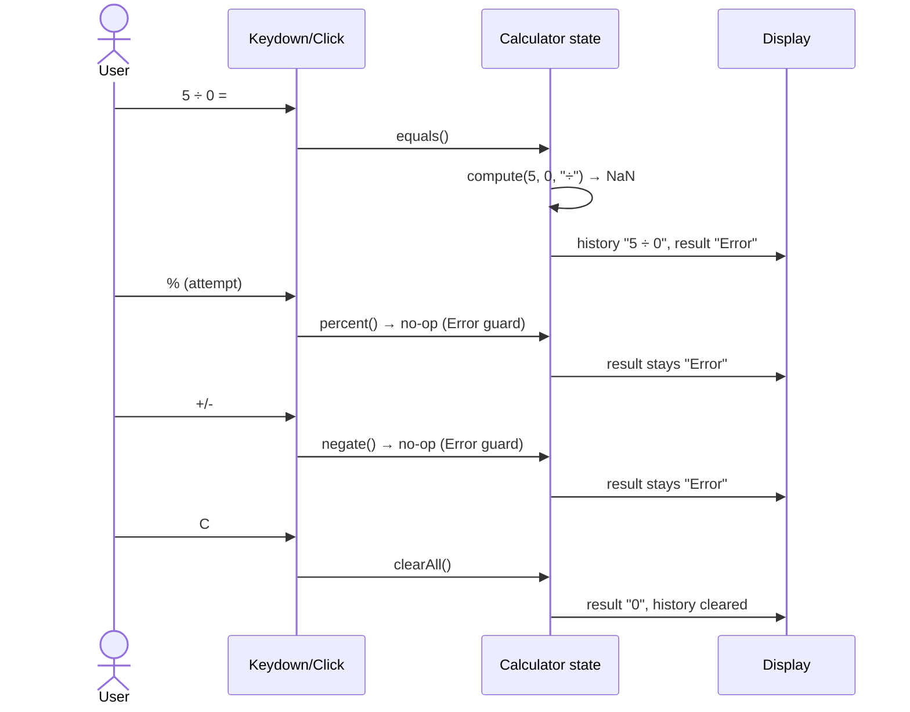

# SPEC.md — Functional Specification

Functional and non-functional specification for the AICalculator. This document defines testable requirements for every feature, plus a verification matrix. Behavior described here reflects the current implementation in `assets/js/script.js` and `assets/js/gradient-waves.js`.

---

## 1. Overview & Scope

The app is a single-page calculator supporting the four basic arithmetic operations, percent, negation, decimals, clearing, two visual themes, an animated WebGL2 background, and full keyboard input. It is intentionally dependency-free and runs as a static file.

**Out of scope (deliberately not implemented):**

- Scientific functions (trigonometry, logarithms, memory, etc.)
- A single-file `calculator.html` variant (removed to avoid duplication)
- Server-side processing, persistence, or accounts

---

## 2. Functional Requirements

> IDs use the prefix `FR-`. Each requirement is directly traceable to a function in `script.js`.

### 2.1 Input & Display

| ID    | Requirement                                                                                    | Implementation                      |
| ----- | ---------------------------------------------------------------------------------------------- | ----------------------------------- |
| FR-01 | Entering a digit appends it to the current operand.                                             | `inputNumber()`                     |
| FR-02 | A leading zero is replaced by the first entered digit (`0` → `7`).                              | `inputNumber()`                     |
| FR-03 | Input is capped at **12 digits** (sign and decimal point excluded).                             | `inputNumber()` length guard        |
| FR-04 | A decimal point can be inserted only once per operand (`5.` then `.` is ignored).               | `inputDecimal()`                    |
| FR-05 | The display uses thousands separators (`1234567` → `1,234,567`) while preserving sign/decimals.  | `formatNumber()`                    |
| FR-06 | Backspace removes the last character; a single digit falls back to `0`; a dangling `-` also falls back to `0`. | `keydown` Backspace branch |
| FR-07 | Pressing `C` (or `Escape`) resets all state and the display to `0`.                             | `clearAll()`                        |

### 2.2 Operations

| ID    | Requirement                                                                                          | Implementation      |
| ----- | ---------------------------------------------------------------------------------------------------- | ------------------- |
| FR-08 | `+`, `−`, `×`, `÷` behave as binary operators; `÷` by zero yields `Error`.                           | `compute()`         |
| FR-09 | Choosing an operator stores the current operand and shows it in the history line.                     | `chooseOperator()`  |
| FR-10 | Pressing an operator twice resolves the pending operation first (chaining: `2 + 3 +` → `5 +`).        | `chooseOperator()`  |
| FR-11 | `=` evaluates the pending expression, shows the full expression in history, and resets the pending operator. | `equals()`   |
| FR-12 | After `=`, typing a digit or `.` starts a brand-new entry (does not append to the result).            | `justEvaluated` flag |
| FR-13 | `%` divides the current value by 100 (`50` → `0.5`).                                                 | `percent()`         |
| FR-14 | `+/-` toggles the sign of the current operand; ignored on `0`.                                       | `negate()`          |

### 2.3 Error Handling

| ID    | Requirement                                                                                             | Implementation                |
| ----- | ------------------------------------------------------------------------------------------------------- | ----------------------------- |
| FR-15 | Division by zero displays `Error`.                                                                      | `equals()` → `trimResult()`  |
| FR-16 | In the `Error` state, `%` and `+/-` are no-ops (they must not corrupt the display).                     | guards in `percent()`/`negate()` |
| FR-17 | In the `Error` state, an operator, digit, or `C` clears the error and starts fresh.                     | `chooseOperator()` reset guard + `inputNumber()`/`inputDecimal()` via `justEvaluated` |

### 2.4 Formatting & Precision

| ID    | Requirement                                                                                          | Implementation     |
| ----- | ---------------------------------------------------------------------------------------------------- | ------------------ |
| FR-18 | Results are capped at 8 decimal places with trailing zeros trimmed (`0.1+0.2` → `0.3`).              | `trimResult()`     |
| FR-19 | Results larger than 12 digits fall back to 10 significant figures (`toPrecision(10)`).                | `trimResult()`     |
| FR-20 | `Error` is never passed through the number formatter (guarded at the source).                         | `equals()` / `compute()` |
| FR-31 | The result font scales down automatically (`--result-font-size` + `fitResultFont()`) so numbers up to 12 digits are always fully visible without ellipsis truncation. | `fitResultFont()` |

### 2.5 Themes

| ID    | Requirement                                                                                           | Implementation            |
| ----- | ----------------------------------------------------------------------------------------------------- | ------------------------- |
| FR-21 | The theme button toggles `body[data-theme]` between `dark` and `light`.                               | `themeToggle` click handler |
| FR-22 | Toggling updates the CSS tokens, `<meta name="theme-color">`, and the WebGL wave colors in real time.  | `applyThemeMeta()` + `syncWavesTheme()` |

### 2.6 Keyboard

| ID    | Requirement                                                                                              | Implementation              |
| ----- | -------------------------------------------------------------------------------------------------------- | --------------------------- |
| FR-23 | All on-screen actions are reachable from the keyboard (`0–9`, `.`, `+ - * /`, `Enter`/`=`, `Escape`, `%`, `Backspace`). | `keydown` handler |
| FR-24 | The button matching a pressed key flashes briefly (`.btn-pressed`, 150 ms).                              | `flashButton()`             |
| FR-25 | Scroll/navigation keys (`Space`, arrows, `PageUp/Down`, `Home/End`) are intercepted so they cannot scroll or jump the page. | `keydown` guard |

### 2.7 Accessibility

| ID    | Requirement                                                                                          | Implementation             |
| ----- | ---------------------------------------------------------------------------------------------------- | -------------------------- |
| FR-26 | Theme button exposes `aria-label="Toggle dark and light mode"`.                                      | `index.html`               |
| FR-27 | All buttons are native `<button>` elements (keyboard focusable, Enter/Space activatable).             | `index.html`               |
| FR-28 | `result` and `history` use `aria-live="polite"`.                                                      | `index.html`               |
| FR-29 | Focus is visible via an orange `:focus-visible` ring.                                                 | `components.css`           |
| FR-30 | Page zoom is not blocked (no `maximum-scale` restriction in the viewport).                            | `index.html`               |

### 2.8 Convenience Buttons

| ID    | Requirement                                                                                          | Implementation |
| ----- | ---------------------------------------------------------------------------------------------------- | -------------- |
| FR-32 | `⌫` deletes the last digit; falls back to `0`; after an evaluation it clears everything.             | `deleteLast()` |
| FR-33 | `CE` clears only the current entry, preserving the pending operator and history.                     | `clearEntry()` |
| FR-34 | `ײ` squares the current value; ignored in the `Error` state; produces a fresh result.               | `square()`     |
| FR-35 | `√` computes the square root; a negative value yields `Error`; produces a fresh result.              | `sqrt()`       |

### 2.9 Sidebar Navigation

| ID    | Requirement                                                                                          | Implementation                 |
| ----- | ---------------------------------------------------------------------------------------------------- | ------------------------------ |
| FR-36 | Sidebar displays brand "AI Calculator" with icon at the top.                                         | `index.html` sidebar-brand     |
| FR-37 | Search bar with placeholder "Search" and inline SVG search icon is displayed below brand.            | `index.html` sidebar-search    |
| FR-38 | Navigation menu includes Home (active), AI Chatbot (demo), Projects (demo), Settings (demo).         | `index.html` sidebar-nav       |
| FR-39 | Home nav item has `aria-current="page"` and visual active state (background + left indicator bar).   | `index.html` + `components.css`|
| FR-40 | Demo nav items (Chatbot, Projects, Settings) display a "Demo" badge.                                | `index.html` sidebar-nav-badge |
| FR-41 | Sidebar toggle button (hamburger) is in the calculator top bar with `aria-label` and `aria-expanded`.| `index.html` sidebar-toggle    |
| FR-42 | Sidebar opens/closes with smooth CSS transform transition.                                           | `openSidebar()`/`closeSidebar()`|
| FR-43 | On desktop (`≥769px`), sidebar slides from left as a side panel; calculator shifts right.            | `responsive.css`               |
| FR-44 | On mobile (`≤768px`), sidebar becomes a full-height overlay drawer with semi-transparent backdrop.    | `responsive.css`               |
| FR-45 | Backdrop click closes the sidebar.                                                                   | `sidebarOverlayEl` click handler|
| FR-46 | Escape key closes profile menu first, then sidebar.                                                  | `keydown` handler               |
| FR-47 | User profile section is sticky at the bottom of the sidebar with avatar, name, plan, and chevron.    | `sidebar-profile`              |
| FR-48 | Profile dropdown shows Settings, Upgrade plan, and Log out menu items on click.                      | `toggleProfileMenu()`          |
| FR-49 | Sidebar is compatible with dark and light themes via CSS custom properties.                           | `variable.css` sidebar tokens  |
| FR-50 | Sidebar uses glassmorphism: semi-transparent background, backdrop blur, border, shadow.              | `components.css`               |

---

## 3. Non-Functional Requirements

| ID    | Requirement                                                                                               | Implementation                       |
| ----- | --------------------------------------------------------------------------------------------------------- | ------------------------------------ |
| NFR-01 | Works as a static file with no server, build step, or network requests.                                  | —                                    |
| NFR-02 | Graceful degradation without WebGL2: solid background, calculator fully functional, `console.warn` logged. | `gradient-waves.js` guard            |
| NFR-03 | Graceful degradation without `backdrop-filter`: semi-transparent card without blur.                       | CSS                                  |
| NFR-04 | Respects `prefers-reduced-motion`: waves animation off, CSS transitions removed.                          | JS + `style.css` media query          |
| NFR-05 | Rendering pauses when the tab is hidden or the canvas is off-screen (perf/CPU friendly).                  | `visibilitychange` + `IntersectionObserver` |
| NFR-06 | Backing-store DPR capped at 2 to limit GPU load on high-DPI displays.                                     | `setSize()` in `gradient-waves.js`    |
| NFR-07 | No external dependencies or CDN assets.                                                                   | —                                    |

---

## 4. Responsive Behavior

| Breakpoint            | Behavior                                                       |
| --------------------- | -------------------------------------------------------------- |
| Default (mobile)      | Card `max-width: 340px`, 4-column fraction grid.                |
| `≤360px`              | Card shrinks (`max-width: 100%`, radius 36px), result 40px, buttons 21px. |
| `≥480px`              | Card widens to `380px`.                                         |

---

## 5. Interaction Flows

### 5.1 Simple evaluation (`2 + 3 =`)

### 5.2 Division by zero (`5 ÷ 0 =`)

---

## 6. Verification Matrix

Manual test checklist. Each row maps to the requirements above.

| #  | Test step                                                       | Expected result                                         | FR        |
| -- | --------------------------------------------------------------- | ------------------------------------------------------- | --------- |
| 1  | Press `7`                                                        | Display shows `7`                                        | FR-01/02  |
| 2  | Enter `1234567890123` (13 digits)                                | Input capped at 12 digits                                | FR-03     |
| 3  | `5` `.` `.` `5`                                                  | Display `5.5` (single decimal)                           | FR-04     |
| 4  | Enter `1234567`                                                  | Display `1,234,567`                                      | FR-05     |
| 5  | Enter `5`, press Backspace                                       | Display `0`                                              | FR-06     |
| 6  | Enter `-5` (via `5` `+/-`), Backspace                            | Display `0` (not `-`)                                    | FR-06     |
| 7  | Press `C`                                                        | Everything resets to `0`                                 | FR-07     |
| 8  | `8` `÷` `4` `=`                                                  | Display `2`                                              | FR-08/11  |
| 9  | `2` `+` `3` `+` `5` `=`                                          | Display `10` (chaining works)                            | FR-10     |
| 10 | `5` `÷` `0` `=`                                                  | Display `Error`                                          | FR-15     |
| 11 | From `Error`, press `%` then `+/-`                               | Display stays `Error`                                    | FR-16     |
| 12 | From `Error`, press `C`, then `7`                                | Display `7`, clean state                                 | FR-17     |
| 13 | `0.1` `+` `0.2` `=`                                              | Display `0.3` (no floating-point artifact)               | FR-18     |
| 14 | `999999999999` `×` `999999999999` `=`                            | Display uses `toPrecision(10)` fallback, finite value    | FR-19     |
| 15 | Click theme button                                               | Theme toggles; meta theme-color and wave colors follow   | FR-21/22  |
| 16 | Press `2`, `+`, `3`, `Enter` on keyboard                         | Display `5`; each key flashes its button                 | FR-23/24  |
| 17 | Press `Space`/arrow keys on keyboard                             | Page does not scroll/jump                                | FR-25     |
| 18 | Tab through buttons                                              | Visible focus ring; Enter/Space activate buttons         | FR-27/29  |
| 19 | DevTools device mode; tap buttons                                | No virtual keyboard appears; calculator usable           | FR-30/NFR |
| 20 | Disable WebGL2 (browser flag)                                    | Solid background, calculator still works, warning logged | NFR-02    |
| 21 | Enter 12 digits (`888888888888`)                                  | Full number visible, font shrinks, no `...`              | FR-31     |
| 22 | Enter `123`, press `⌫`                                            | Display `12`                                             | FR-32     |
| 23 | Enter `5`, `+`, `7`, press `CE`, then `3`, `=`                    | Result `8` (CE preserved `5 +`)                           | FR-33     |
| 24 | Enter `12`, press `ײ`                                            | Display `144`                                            | FR-34     |
| 25 | Enter `16`, press `√`; then `9`, `+/-`, `√`       | Display `4`; then `Error`                                | FR-35     |
| 26 | Inspect the button grid                            | `0` is normal width, `+/-` sits left of `0`, `=` spans two rows, no empty cells | — |

---

## 7. Relationship to Other Documents

| Document              | Relationship                                            |
| --------------------- | ------------------------------------------------------- |
| `docs/DESIGN.md`      | Visual rationale behind tokens, shader, and interactions. |
| `docs/ARCHITECTURE.md`| Code structure and data flow implementing these requirements. |
| `docs/CONTEXT.md`     | Why the decisions behind this spec were made.           |
| `docs/CHANGELOG.md`   | When each requirement was introduced or fixed.          |